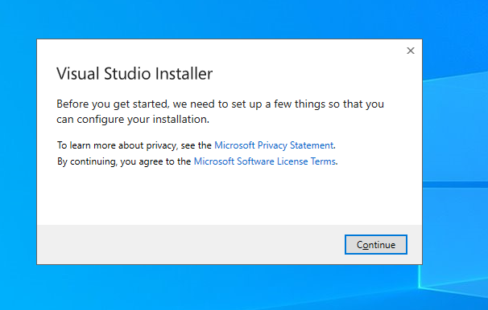
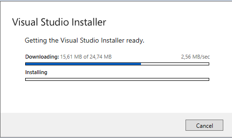
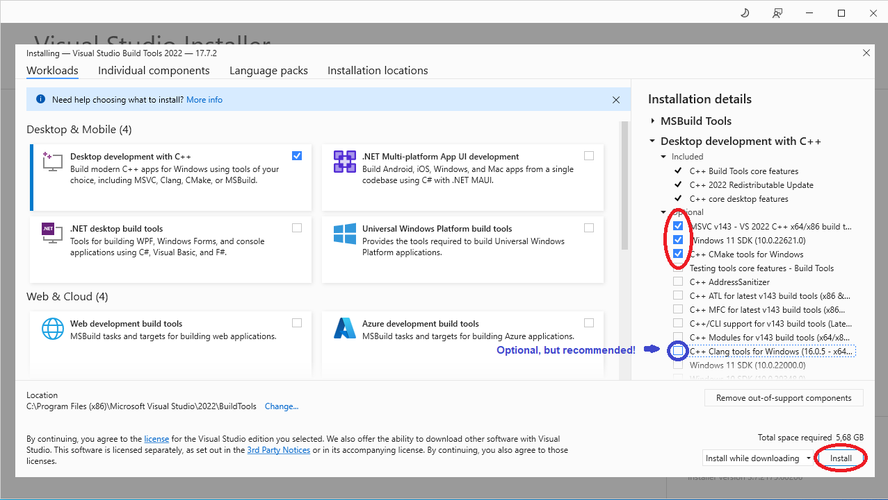
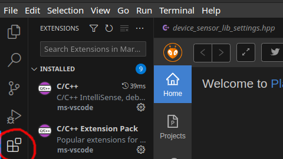
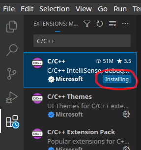
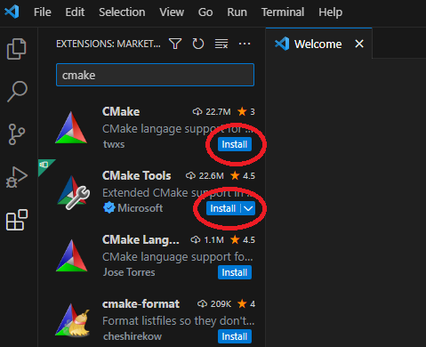
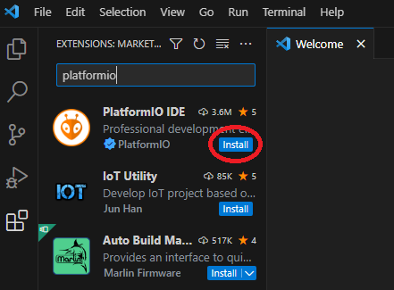

# Building and Flashing

This guide will guide you through the steps needed to get the tests and firmware compiled. The **prerequisites** for the development environment are:

- PlatformIO compatible IDE (VSCode is recommended) with the PlatformIO plugin installed

- Modern version of Python 3.x

- Modern version of CMake and an C/C++ compiler (favoriably MSVC (under Windows) or GCC (Linux and Mac OS))

- Preferably a VT100 compatible terminal emulator (Putty is recommended)

- Local copy of this git repository (git clone)

## Install an c/c++ compiler

This is needed for compiling the unit-tests and configuring some parts of the build-system.
!!! Installation

	=== "Windows"
		Step 1: Download the [VS Buildtools installer](https://aka.ms/vs/17/release/vs_BuildTools.exe) and launch the installer.
		
		Step 2: Accept the EULA and continue:
		
		
		If done correctly this screen should show up.. Wait for the download to finish :)
		
		
		Step 3: Select the following options and click on the install button:
		
		
		/// note | C++ Clang tools for Windows
		Clang has tools for static code analysis and code formatting
		(besides being an compiler frontend (llvm)).
		
		Which might be very useful when trying to write consistent code following code
		rules.
		
		///
		Step 4: Wait for the installation to finish :w
		/// success | Done, your setup is now ready :)
		///

	=== "Linux(Ubuntu or Debian)"

		The fastest way to install the compiler and required tools in linux is by using the terminal. 
		
		Step 1: Open a terminal and enter:
		```
		sudo apt-get install gcc cmake
		```
		/// success | Done, your setup is now ready :)
		///
	=== "Linux(Arch or Manjaro)"
		The fastest way to install the compiler and required tools in linux is by using the terminal. 
		
		Step 1: Open a terminal and enter:
		```
		sudo pacman -S gcc cmake
		```

	=== "Mac os"
		In Mac os the same principle applies as would to linux. The fastest way is using  [HomeBrew](https://brew.sh/index_nl) in the terminal.
		
		Step 1: 
		
		```
		brew install gcc cmake
		```
		/// success | Done, your setup is now ready :)
		///


## Setup VSCode
This section is dedicated to describing the steps needed to setup the VSCode editor to support our development environment. 
The following plugins will have to be installed:

- C/C++

- CMake

- CMake Tools

- PlatformIO IDE

Step 1: Open VS Code and head to the extensions tab (4th icon in the left sidebar). 



Step 2: Search and install the following plugins:

??? note "Plugin C/C++"
	Search for the plugin in the search bar: **C/C++** from publisher: ms-vscode or Microsoft. Click on install...
	
	
??? note "Plugins CMake and CMake Tools"
	Search for the plugin in the search bar: **CMake*. Install the plugins CMake and CMake Tools from publisher: twxs and Microsoft. And Click on install...
	
	
	
??? note "Plugin PlatformIO IDE"
	Search for the plugin in the search bar: **PlatformIO IDE** from publisher: PlatformIO. Click on install...
	

## Building Projects (SensorHub_FW and ActuatorHub_FW)


